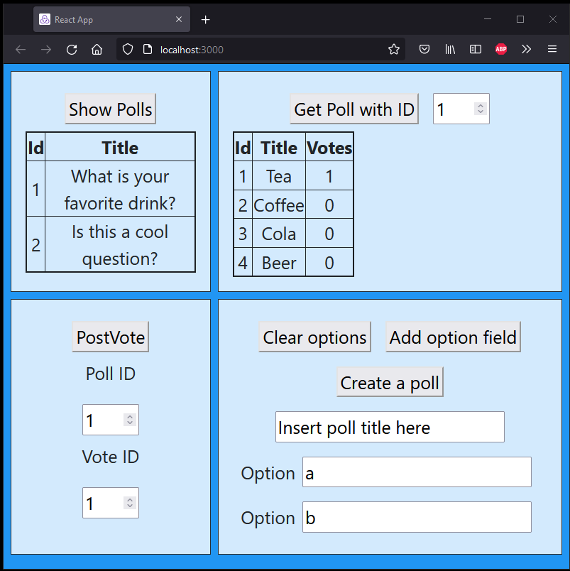

# PollApp



PollApp is simple prototype application made to create polls and read/insert data

> Application is made using following technologies:
>
> - Front-end: ReactJS
> - Backend: .NET framerwork
> - Database: SQLite.

> This application was created by Juho Järvenpää

## Requirements

### Frontend

Requires Node.js installed with npm. (lastest version for compatibility)

### Backend

Visual studio (Visual Studio 2019 is recommended)

## Setup and run

#### Downloading the project

Goto to [project git page]() and dowload repository or run command

```powershell
git clone
```

#### Back-end

- Navigate to folder `pollApp` --> `dotnet-backend`
- Open `DotNETBackend.sln` with visual studio
- press `ctrl + shift + b` or select `Build -> Build solution` to build solution
- Navigate to folder `src` --> `bin` --> `Release`
- Right click `DotNetBackend.exe` and select `Run as administrator`
- Server opens up in a console window and is ready to serve
- Closing the window shutdowns the backend server

#### Front-end

- Open up a terminal and navigate to folder `pollApp` --> `react-frontend`
- Type `npm install` and press `Enter`
- Type `npm start` and press `Enter`
- This opens up a browser where application front-end can be seen.
- You can access application after it is started in with url: [http://localhost:3000](http://localhost:3000)
- To close front-end teminate process on terminal (close terminal or press `ctrl + c` and then `y` and then `enter`)

#### Note!

> Back-end must be up and running to be able to make requests with front-end

#### Database

- Database is included inside of backend and nothing needed to be done to use it
- Database structure can be seen down below

```SQL
CREATE TABLE sqlite_sequence(name,seq);
CREATE TABLE IF NOT EXISTS "polls"("id" INTEGER,"title" TEXT,PRIMARY KEY("id" AUTOINCREMENT));
CREATE TABLE options (optionId INTEGER PRIMARY KEY AUTOINCREMENT, id int, title TEXT, votes int, pollId int);
```
